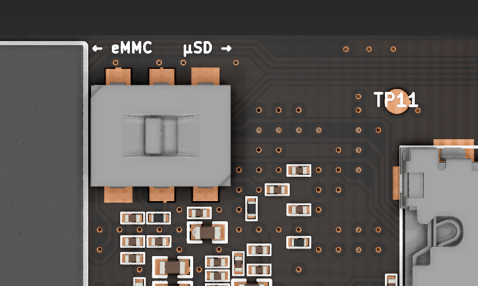

# USB armory Mk II boot modes

The USB armory Mk II supports 3 boot mechanisms:

* internal 16GB eMMC
* external microSD
* USB Serial Download Protocol (SDP)

A slide switch allows selection of the primary boot mode. The switch positions
match the position of the storage media components:

* left  (towards eMMC):         boot from internal eMMC
* right (towards microSD slot): boot from external microSD



# Fallback

The boot process falls back to other boot modes, in case the attempted boot
fails to find valid instructions.

* eMMC boot mode:
  1. Try eMMC
  2. Fall back to microSD
  3. Fall back to USB SDP mode

* microSD boot mode:
  1. Try microSD
  2. Fall back to USB SDP mode

# Serial Download Protocol (SDP)

The `armory-boot-usb` serial downloader can be found in the
[armory-boot repository](https://github.com/f-secure-foundry/armory-boot/tree/master/cmd/armory-boot-usb)
and used to directly download and execute code on the SoC over USB.

```
sudo $GOPATH/bin/armory-boot-usb -i image.imx
```

Alternatively the [imx usb loader repository](https://github.com/boundarydevices/imx_usb_loader)
can be used, also providing the ```verify``` and ```debugmode``` flags as debugging aid to
verify correct SoC operation.

```
sudo imx_usb -v -d image.imx
```

# Flashing bootable images on external/internal media

The following instructions provide instructions on flashing bootable images on
either an external microSD card, connected to a host with a built-in or
externally connected card reader, or the internal eMMC.

The USB armory Mk II itself can be used as a microSD/eMMC reader using
[armory-ums](https://github.com/f-secure-foundry/armory-ums).

**WARNING**: the following operations will destroy any previous contents on the
target eMMC/microSD.

## Flashing i.MX native images

The `imx` image format represents bootable images that can be loaded directly
by the SoC boot ROM, examples include bootloaders (e.g. U-Boot, [armory-boot](https://github.com/f-secure-foundry/armory-boot))
or bare metal unikernels (e.g. [TamaGo](https://github.com/f-secure-foundry/tamago)).

Linux (verify target from terminal using `dmesg`, e.g. /dev/sdX):
```
sudo dd if=image.imx of=$TARGET_DEV bs=512 seek=2 conv=fsync
```

Mac OS X (verify target from terminal with `diskutil list`, e.g. /dev/rdiskN):
```
sudo dd if=image.imx of=$TARGET_DEV bs=512 seek=2
```

## Flashing raw disk images

Raw disk images are meant to fill the entire boot media, examples include full
OS images such as the [USB armory Debian base image](https://github.com/f-secure-foundry/usbarmory-debian-base_image).

Linux (verify target from terminal using `dmesg`, e.g. /dev/sdX):
```
sudo dd if=image.raw of=$TARGET_DEV bs=1M conv=fsync
```

Mac OS X (verify target from terminal with `diskutil list`, e.g. /dev/rdiskN):
```
dd if=image.raw of=$TARGET_DEV bs=1m
```

On Windows the [Etcher](https://etcher.io) utility can be used.
