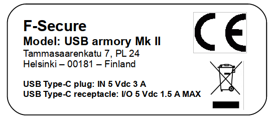
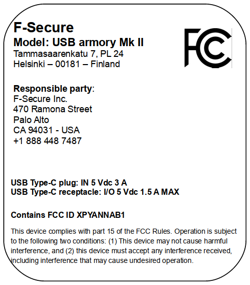

# Regulatory information - USB armory Mk II

F-Secure is committed to providing high quality products and services to all
our customers. F-Secure products are tested and certified according to
applicable laws, regulations, directives and standards per each country or
region where the products are available for sale. Declarations of Conformity
are kept on record and available upon request:

Attn: USB armory compliance  
F-Secure Corporation  
Tammasaarenkatu 7, P.O. Box 24  
00181 Helsinki, Finland

## EU Declaration of conformity

The USB armory Mk II is in conformity with the relevant Union harmonisation
legislation:

* 2014/53/EU relating to the making available on the market of radio equipment
* 1999/519/EC on the limitation of exposure of the general public to electromagnetic fields

References to the relevant harmonised standards used or references to the other
technical specifications in relation to which conformity is declared:

* EN 300 328  Wideband transmission systems; Data transmission equipment operating in the 2,4 GHz ISM band and using wide band modulation techniques; Harmonised Standard covering the essential requirements of article 3.2 of Directive 2014/53/EU 
* EN 301 489-1 Electromagnetic compatibility and Radio spectrum Matters (ERM); ElectroMagnetic Compatibility (EMC) standard for radio equipment and services; Part 1: Common technical requirements
* EN 301 489-17  Electromagnetic compatibility and Radio spectrum Matters (ERM); ElectroMagnetic Compatibility (EMC) standard for radio equipment; Part 17: Specific conditions for Broadband DataTransmission Systems
* EN/IEC 62368-1 Audio/video, information and communication technology equipment - Part 1: Safety requirements
* EN 62479  Assessment of the compliance of low power electronic and electrical equipment with the basic restrictions related to human exposure to electromagnetic fields (10 MHz to 300 GHz)

## EU Waste Electrical and Electronic Equipment (WEEE) Directive

Important information for correct disposal of the product in accordance with EC
Directive 2002/96/EC.

At the end of its working life, the product must not be disposed of as urban
waste. It must be taken to a special local authority differentiated waste
collection centre or to a dealer providing this service.

Disposing of a household appliance separately avoids possible negative
consequences for the environment and health deriving from inappropriate
disposal and enables the constituent materials to be recovered to obtain
significant savings in energy and resources.

As a reminder of the need to dispose of household appliances separately, the
product is marked with a crossed-out wheeled dustbin.

Units can be collected free of charge by F-Secure for disposal, contact
[support](https://github.com/usbarmory/usbarmory/wiki#support) to arrange it.

## REACH and RoHS compliance declaration

REACH (Registration, Evaluation, Authorisation and Restriction of Chemicals) is
the EU regulatory framework for controlling chemical substances. RoHS
(Restriction of Hazardous Substances) is the EU directive that restricts the
use of certain hazardous materials in electronic and electrical equipment.
Information of controlled substances contained in this product is available
upon request, see the address above.

## Federal Communication Commission statements (contains FCC ID: XPYANNAB1)

This device complies with part 15 of the FCC Rules. Operation is subject to the
following two conditions: (1) This device may not cause harmful interference,
and (2) this device must accept any interference received, including
interference that may cause undesired operation."

This equipment has been tested and found to comply with the limits for a Class
B digital device, pursuant to Part 15 of the FCC rules as documented in the
above referenced test report. These limits are designed to provide reasonable
protection against harmful interference in a residential installation. This
equipment generates, uses, and can radiate radio frequency energy and, if not
installed and used in accordance with the instructions, may cause harmful
interference to radio communications.

This equipment referenced in this declaration is identical to the unit tested
and found acceptable with the standards. The technical records maintained by
the responsible party continue to reflect the equipment being produced under
this Declaration of Conformity within the variation that can be expected due to
quantity production and testing on a statistical basis.

### Applicable compliance statements

FCC Title 47 Part 15C to which this declaration relates is in conformity with
the requirements of the following specifications: ANSI C63.4:2014 - FCC CFR
47:2016 Part 15B - Class B device. As stated on Test Report number
SC-02817-125-05 issued by SICOM IT in date 23/10/2019.

## Canadian Department of Communications (contains IC: 8595A-ANNAB1)

This device complies with Industry Canada license-exempt RSS standard(s).
Operation is subject to the following two conditions: (1) This device may not
cause harmful interference, and (2) this device must accept any interference
received, including interference that may cause undesired operation of the
device.

### Applicable compliance statements

Canadian Department of Communications ICES-003 “Digital Apparatus” to which
this declaration relates is in conformity with CAN ICES-3 (B)/NMB-3(B). As
stated on Test Report number SC-02817-125-05 issued by SICOM IT in date
23/10/2019.

## Product safety information

This section explains the safety guidelines that help protect your product from
potential damage and ensure your personal safety. To reduce the risk of bodily
injury, electrical shock, fire, and damage to the equipment, follow these
precautions:

* Indoor use only
* AC inputs: USB Type-C plug - IN 5 Vdc 3 A, USB Type-C receptacle: I/O 5 Vdc 1.5 A MAX
* Operating temperature: -20°C to +70°C
* Operating humidity: 25%-75% HR
* Disconnect the product from the electrical supply and replace the part or contact the seller in the following cases:
  * The power plug is damaged.
  * The product has been exposed to water.
  * The product has been dropped or damaged.
  * The product does not operate correctly when you follow the operating instructions.
* Use only the type of external power source that is indicated on the electrical ratings label of your product.
* Always hold the plug by its sides when you connect or disconnect your product.
* Do not touch the metal parts of the plug.
* To turn off power completely to your product, disconnect it from the power source.
* Keep your system away from radiators and heat sources.
* Do not spill food or liquids on the product.
* Do not operate the product in a wet environment.
* Do not push any objects into the openings of the product. Doing so can cause fire or electric shock by shorting out interior components.
* Make sure that the attached devices are electrically suitable to operate with the power available in your location.
* Never force a connector into a port. Make sure that the connector matches the port and that you are connecting them in the correct position in relation to each other.
* Plug the system and peripheral power cables into properly grounded electrical outlets to help prevent electric shock.
* Use a surge suppressor, line conditioner, or uninterruptible power supply (UPS) to help protect your product from sudden, transient increases and decreases in electrical power.
* Position cables and power cables carefully so that they cannot be stepped on or tripped over. Make sure that nothing rests on any cables.
* Do not modify power cables or plugs.
