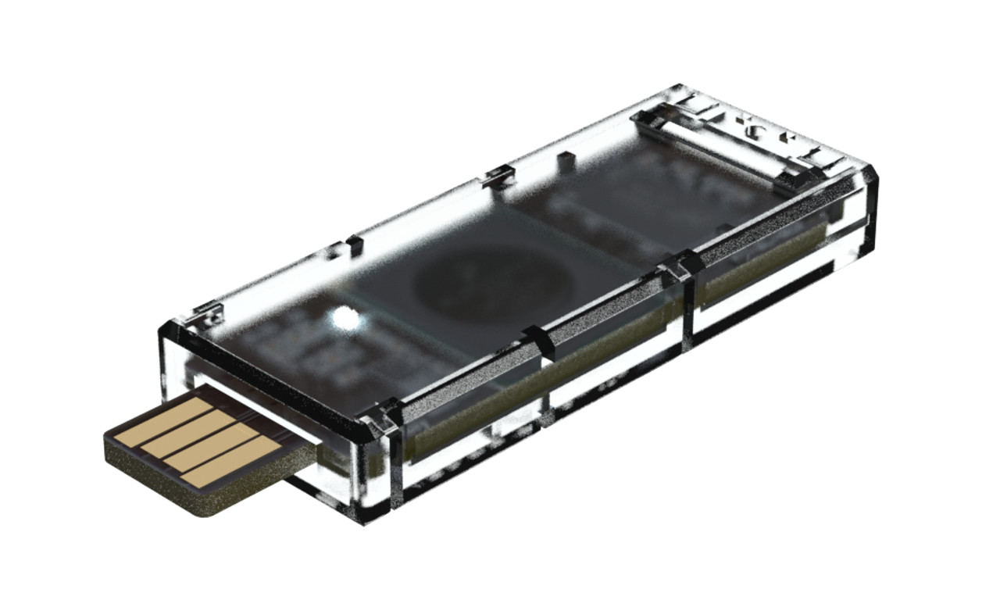

## Official

The USB armory enclosure from [Inverse Path](https://www.inversepath.com) is a custom 4 pieces design (3 body parts + 1 cap) specifically designed to accommodate and protect the board.

The enclosure can be easily assembled by snapping in three separate body parts, one of which acts as a sliding cover for the microSD card. A removable cap protects the 5-pin breakout header.

Just like the USB armory, the enclosure manufacturing, including its material, is entirely made in Italy.

* [Technical Diagram](https://github.com/f-secure-foundry/usbarmory/blob/master/hardware/mark-one/enclosure_diagram-20150611.pdf)

* Specifications:
  * Dimensions:
    * body: 61 x 24 x 9 mm
    * plug cap: 13 x 23 x 7 mm
  * Material: NEVIESTER EG83 (PETG)
  * Color: transparent (clear or [black](https://twitter.com/AndreaBarisani/status/800652673171279872))

**HINT**: To remove the microSD sliding cover push it outwards with your thumb, on the side of the memory card, and pull it simultaneously with your other hand index fingernail, on the opposite side.

**NOTE**: A cap for the USB plug was included in earlier enclosures but later removed due to width tolerance issues.

## 3rd party

**NOTE**: The 3rd party enclosures in this section have not been designed, manufactured or tested by Inverse Path.

* [Crowd Supply](https://www.crowdsupply.com/): [Premium USB Armory Enclosure](https://www.crowdsupply.com/crowd-supply/armory-mk1-enclosure)

## Contributed

**NOTE**: The 3D printed enclosures in this section have not been tested by Inverse Path for usage with the USB armory, therefore **use them at your own risk**. The Polylactic acid (PLA) materials used by desktop 3D printers have different melting temperatures depending on the specific kind, not all PLAs are compatible with the temperature profile of the USB armory on high CPU loads. The use of ABS or Polyamide should lead to more compatible enclosures.

* [Al Jigong Billings](http://makehacklearn.org/): [https://github.com/albill/USB-armory-case](https://github.com/albill/USB-armory-case)

* [Ben Gamari](http://bgamari.github.io): [https://github.com/bgamari/usb-armory-case](https://github.com/bgamari/usb-armory-case)

* Lars Pötter: [https://www.youmagine.com/designs/case-for-usb-armory](https://www.youmagine.com/designs/case-for-usb-armory)
