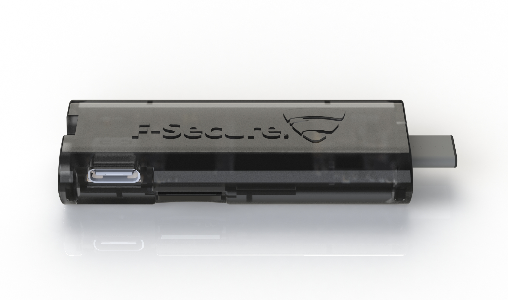

Welcome to the USB armory wiki.

The USB armory from [F-Secure Foundry](https://foundry.f-secure.com) is an open
source hardware design, implementing a flash drive sized computer.

# Purchasing

See [Ordering information](https://github.com/f-secure-foundry/usbarmory/wiki/Ordering-information)
for USB armory Mk II variants, accessories and purchase options.

The USB armory Mk II can be purchased at the following resellers:
  * [Mouser](https://eu.mouser.com/new/f-secure/crowd-supply-usb-armorymkii)
  * [Crowd Supply](https://www.crowdsupply.com/f-secure/usb-armory-mk-ii)
  * [Hackerwarehouse](https://hackerwarehouse.com/product/usb-armory-mkii)
  * [HackmoD](http://www.hackmod.de/USB-Armory-Stick-Mark-2)
  * [SparkFun](https://www.sparkfun.com/products/16367)
  * [Antratek](https://www.antratek.com/usb-armory-mk-ii-w-enclosure)

Custom/bulk order inquiries can be placed directly by contacting
usbarmory@f-secure.com.

# Documentation

* [**Getting started**](https://github.com/f-secure-foundry/usbarmory/wiki/Starting)
* [Preparing a bootable image](https://github.com/f-secure-foundry/usbarmory/wiki/Preparing-a-bootable-image)
* [Buildroot profiles](https://github.com/f-secure-foundry/usbarmory/tree/master/software/buildroot)
* [Host communication](https://github.com/f-secure-foundry/usbarmory/wiki/Host-communication)
* [Applications](https://github.com/f-secure-foundry/usbarmory/wiki/Applications)
* [Frequently Asked Questions (FAQ)](https://github.com/f-secure-foundry/usbarmory/wiki/Frequently-Asked-Questions-(FAQ))
* Application repositories
  * [INTERLOCK file encryption front-end](https://github.com/f-secure-foundry/interlock)
  * [Crucible OTP fusing tool](https://github.com/f-secure-foundry/crucible)
* Operating Systems
  * [Precompiled images](https://github.com/f-secure-foundry/usbarmory/wiki/Available-images)
  * [Debian image preparation](https://github.com/f-secure-foundry/usbarmory/wiki/Preparing-a-bootable-image)
  * Embedded INTERLOCK distribution: [Mk II](https://github.com/f-secure-foundry/usbarmory/tree/master/software/buildroot/README-INTERLOCK-mark-two.md), [Mk I](https://github.com/f-secure-foundry/usbarmory/tree/master/software/buildroot/README-INTERLOCK.md)
  * Arch Linux ARM: [Mk II](https://archlinuxarm.org/platforms/armv7/freescale/usb-armory-mk-ii), [Mk I](http://archlinuxarm.org/platforms/armv7/freescale/usb-armory)
  * Kali Linux: [Mk I](https://www.kali.org/docs/arm/kali-linux-usb-armory/)
  * Genode OS: [Mk I](https://github.com/f-secure-foundry/usbarmory/wiki/Genode-OS)
* Go bare metal unikernels with [TamaGo](https://github.com/f-secure-foundry/tamago)
  * OpenPGP/U2F smartcard: [GoKey](https://github.com/f-secure-foundry/GoKey)
  * USB Mass Storage interfacing: [armory-ums](https://github.com/f-secure-foundry/armory-ums)
  * Secure primary boot loader: [armory-boot](https://github.com/f-secure-foundry/armory-boot)
* [External resources](https://github.com/f-secure-foundry/usbarmory/wiki/External-resources)

The following sections provide information specific to each USB armory model.

# USB armory Mk II

 

* Specifications
  * SoC: NXP i.MX6UL/i.MX6ULZ ARM® Cortex™-A7 528/900 MHz
  * RAM: 512 MB or 1 GB DDR3
  * Storage: internal 16 GB eMMC + external microSD
  * Bluetooth module: u-blox ANNA-B112 BLE
  * USB 2.0 over USB-C: DRP receptacle + UFP plug
  * Secure elements: SE050 (rev. γ), Microchip ATECC608A + NXP A71CH (rev. β)
* [Datasheet](https://github.com/f-secure-foundry/usbarmory/wiki/media/usbarmory-mark-two-datasheet-rev2.0.pdf)
* [Introduction](https://github.com/f-secure-foundry/usbarmory/wiki/Mk-II-Introduction)
* [Bill of materials](https://f-secure-foundry.github.io/BOM/usbarmory-mark-two.html)
* [Security features](https://github.com/f-secure-foundry/usbarmory/wiki/Hardware-security-features-(Mk-II))
* [Secure boot](https://github.com/f-secure-foundry/usbarmory/wiki/Secure-boot-(Mk-II))
* [Benchmarks](https://github.com/f-secure-foundry/usbarmory/wiki/Benchmarks-(Mk-II))
* [Power consumption](https://github.com/f-secure-foundry/usbarmory/wiki/Power-consumption)
* [Internal Boot ROM](https://github.com/f-secure-foundry/usbarmory/wiki/Internal-Boot-ROM-(Mk-II))
* [Enclosures](https://github.com/f-secure-foundry/usbarmory/wiki/Enclosures-(Mk-II))
* [JTAG](https://github.com/f-secure-foundry/usbarmory/wiki/JTAG-(Mk-II))
* [Debug accessory](https://github.com/f-secure-foundry/usbarmory/tree/master/hardware/mark-two-debug-accessory)
* [Boot modes](https://github.com/f-secure-foundry/usbarmory/wiki/Boot-Modes-(Mk-II))
* [Bluetooth](https://github.com/f-secure-foundry/usbarmory/wiki/Bluetooth)
* [I²C](https://github.com/f-secure-foundry/usbarmory/wiki/I²C-(Mk-II))
* Cryptography co-processor drivers: [DCP](https://github.com/f-secure-foundry/mxs-dcp) (i.MX6ULZ), [CAAM](https://github.com/f-secure-foundry/caam-keyblob) (i.MX6UL)
* Hardware control tool: [armoryctl](https://github.com/f-secure-foundry/armoryctl)
* [Errata](https://github.com/f-secure-foundry/usbarmory/wiki/Errata-(Mk-II))

# USB armory Mk I

 

* Specifications
  * SoC: NXP i.MX53 ARM® Cortex™-A8 800 MHz
  * RAM: 512 MB DDR3
  * Storage: external microSD
  * USB 2.0 over Type-A: OTG plug
* [Bill of materials](https://f-secure-foundry.github.io/BOM/usbarmory-mark-one.html)
* [Security features](https://github.com/f-secure-foundry/usbarmory/wiki/Hardware-security-features-(Mk-I))
* [Secure boot](https://github.com/f-secure-foundry/usbarmory/wiki/Secure-boot-(Mk-I))
* [Secure boot (with NXP tools)](https://github.com/f-secure-foundry/usbarmory/wiki/Secure-boot-with-NXP-tools-(Mk-I))
* [Host adapter](https://github.com/f-secure-foundry/usbarmory/wiki/Host-adapter)
* [Device communication (stand-alone mode)](https://github.com/f-secure-foundry/usbarmory/wiki/Host-adapter)
* [Benchmarks](https://github.com/f-secure-foundry/usbarmory/wiki/Benchmarks)
* [Power consumption](https://github.com/f-secure-foundry/usbarmory/wiki/Power-consumption)
* [X-ray](https://github.com/f-secure-foundry/usbarmory/wiki/X-ray)
* [Internal Boot ROM](https://github.com/f-secure-foundry/usbarmory/wiki/Internal-Boot-ROM-(Mk-I))
* [Enclosures](https://github.com/f-secure-foundry/usbarmory/wiki/Enclosures-(Mk-I))
* [JTAG](https://github.com/f-secure-foundry/usbarmory/wiki/JTAG-(Mk-I))
* Using the breakout header: [Serial, GPIOs](https://github.com/f-secure-foundry/usbarmory/wiki/GPIOs), [I²C](https://github.com/f-secure-foundry/usbarmory/wiki/I²C), [SPI](https://github.com/f-secure-foundry/usbarmory/wiki/SPI)
* Cryptography co-processor driver: [SCCv2](https://github.com/f-secure-foundry/mxc-scc2) (i.MX53)
* [Errata](https://github.com/f-secure-foundry/usbarmory/wiki/Errata-(Mk-I))

*Note*: the USB armory Mk I reached End-of-life (EOL) and is no longer available.

# How to Contribute

Get a USB armory board and start developing!

A list of project ideas is available in the
[Applications](https://github.com/f-secure-foundry/usbarmory/wiki/Applications) section.

A discussion group is available on [Google Groups](https://groups.google.com/d/forum/usbarmory).

# Support

If you think anything is missing on this wiki, or require further support,
please email us at usbarmory@f-secure.com.

# License

USB armory | https://github.com/f-secure-foundry/usbarmory  
Copyright (c) F-Secure Corporation

This is an open hardware design licensed under the terms of the CERN Open
Hardware Licence (OHL) v1.2.

You may redistribute and modify this documentation under the terms of the CERN
OHL v.1.2 (http://ohwr.org/cernohl). This documentation is distributed WITHOUT
ANY EXPRESS OR IMPLIED WARRANTY, INCLUDING OF MERCHANTABILITY, SATISFACTORY
QUALITY AND FITNESS FOR A PARTICULAR PURPOSE. Please see the CERN OHL v.1.2 for
applicable conditions.

# Terms of Use and Compliance information

The following Terms of Use apply to USB armory boards manufactured by Inverse
Path and/or F-Secure and sold directly or through one of its resellers.

IMPORTANT – BEFORE INSTALLING OR USING THE USB ARMORY BOARDS MANUFACTURED BY
INVERSE PATH AND/OR F-SECURE, CAREFULLY READ THE BELOW TERMS OF USE (”TERMS”).
BY OPTING TO ACCEPT, BY INSTALLING OR USING THE USB ARMORY YOU (EITHER AN
INDIVIDUAL OR AN ENTITY) WARRANT THAT YOU HAVE READ THESE TERMS, UNDERSTAND
THEM AND AGREE TO BE LEGALLY BOUND BY THEM. IF YOU DO NOT AGREE TO ALL OF THE
TERMS, DO NOT INSTALL OR USE THE USB ARMORY.

* [Terms of Use](https://github.com/f-secure-foundry/usbarmory/wiki/Terms-of-Use)
* [Compliance information](https://github.com/f-secure-foundry/usbarmory/wiki/Compliance-information)
