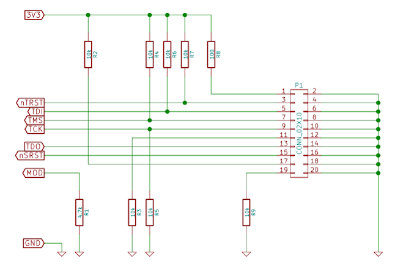
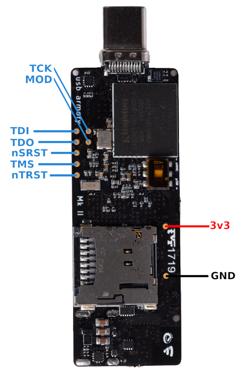

The USB armory Mk II exposes the SoC JTAG interface using 9 test pads.

The following [schematic (PDF)](https://github.com/f-secure-foundry/usbarmory/raw/master/hardware/mark-two/jtag-breakout.pdf) illustrates connection between the pads and a
standard ARM JTAG 20-pin connector.

The following sections help identifying the relevant pads.

| USB armory Mk II - rev. β                                      | USB armory Mk II - rev. γ                                      |
|:--------------------------------------------------------------:|:--------------------------------------------------------------:|
|   |  |

ARM debugging features
----------------------

On ARM Cortex-A7 cores access to ARM debugging features is controlled
via the [debug Authentication interface](https://developer.arm.com/documentation/ddi0464/d/Debug/External-debug-interface?lang=en).

The following signals are expected by the ARM core to be routed in the SoC
configuration:

* `DBGEN`:  Debug Enable
* `SPIDEN`: Secure PL1 Invasive Debug Enable
* `NIDEN`: Non-Invasive Debug Enable
* `SPNIDEN`: Secure PL1 Non-Invasive Debug Enable

The signal status of the debug authentication interface can be checked through the
[DBGAUTHSTATUS](https://developer.arm.com/documentation/ddi0406/b/Debug-Architecture/Debug-Registers-Reference/Management-registers--ARMv7-only/Authentication-Status-Register--DBGAUTHSTATUS-?lang=en) CP14 register.

On the i.MX6ULL/i.MX6ULZ SoCs the `DBGAUTHSTATUS` register is memory mapped at
address `0x02130fb8` and the debugging signals are set as follows:

| Bit | Name | Description                           | Assertion condition                                 |
|:---:|:----:|---------------------------------------|-----------------------------------------------------|
|  6  | SNE  | Secure non-invasive debug enabled     | System JTAG controller (SJC) enabled and connected  |
|  4  | SE   | Secure invasive debug enabled         | System JTAG controller (SJC) enabled and connected  |
|  2  | NSNE | Non-Secure non-invasive debug enabled | always high                                         |
|  0  | NSE  | Non-Secure invasive debug enabled     | KTE OTP not blown and HAB in Open Configuration     |
