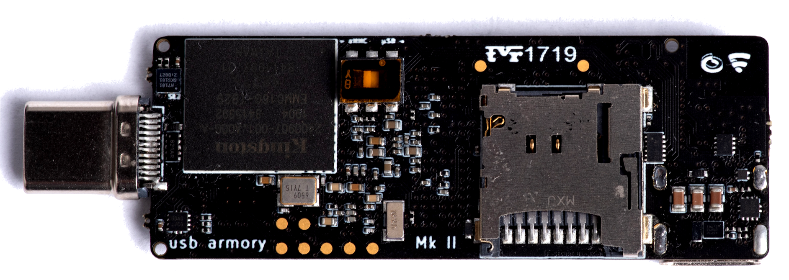

The USB armory from [Inverse Path](https://inversepath.com) is an open source
hardware design, implementing a flash drive sized computer.

The USB armory Mk II, the successor to the current Mk I model, is currently
under development.

This page provides information on the development plan and current progress.

## Current progress

The Mk II bill of materials (BOM) has been defined for most of its active
components. The electrical schematics and PCB layout are in alpha stage and
prototypes are being manufactured.

The porting of Mk I software framework, and integration of Mk II specific
drivers, is underway and mostly completed.

## System-on-Chip

The USB armory Mk II System-on-Chip (SoC) is planned to be a member of the
i.MX6UL family, P/N series MCIMX6G3 (528 Mhz),

A SoC variant using the pin-to-pin compatible i.MX6ULZ P/N is planned to
provide higher speed (900 Mhz) if desired, with the tradeoff of lack of OTF
DRAM encryption (due to lack of CAAM and BEE modules, otherwise available on
i.MX6UL).

## Security features

See a detailed description [here](https://github.com/inversepath/usbarmory/wiki/Hardware-security-features-(Mk-II)).

## Communication interfaces

### USB

The USB armory Mk II features Type-C USB ports, a Type-A variant will be
available to OEM customers upon request.

Using Type-C USB allows us to have a plug for traditional USB based
[host communication](https://github.com/inversepath/usbarmory/wiki/Host-communication)
along with an integrated receptacle to act as a host (or device), without requiring a
[host adapter](https://github.com/inversepath/usbarmory/wiki/Host-adapter).

The USB Type-C current mode allows to ensure that adequate current is
requested on the plug side, to enable connection of additional devices on the
socket side.

This design enables new use cases for the USB armory Mk II, which
can act as a USB firewall without the need of additional hardware as well as being
natively expanded with USB peripherals (e.g. drive, network adapters).

Additionally the integrated receptacle also allows its role to be changed to
device, easing scenarios such as controlled USB fuzzing from one side and
interactive console/control on the other.

### Bluetooth

The Mk II includes a [u-blox ANNA-B112](https://www.u-blox.com/en/product/anna-b112-module)
Bluetooth module for out-of-band (in relation to USB interfaces) interaction
with a wireless client (e.g. mobile application).

The addition of a Bluetooth module opens up a variety of new use cases for the
USB armory Mk II, greatly enhancing its security applications in terms of
authentication, isolation and limiting trust towards the host.

## Storage media

Apart from the traditional microSD slot (now with a push/pull mechanism) the
USB armory Mk II includs an eMMC flash memory on the board.

This allows easier provisioning procedures, factory pre-imaging without the
burden of microSD card installation and enables additional security features.

Additionally a slide switch allows selection of the boot mode (microSD vs
eMMC), supporting easy selection of boot media for dual boot purposes (e.g.
full Linux OS vs [INTERLOCK](https://github.com/inversepath/interlock)
protected image).

## Software

A Linux kernel driver for the CAAM (i.MX6UL), which takes advantage of the
OTPMK released by the SNVS, is available at
[https://github.com/inversepath/caam-keyblob](https://github.com/inversepath/caam-keyblob).

The [INTERLOCK](https://github.com/inversepath/interlock) file encryption
front-end supports the CAAM through this driver.

A Linux kernel driver for the DCP (i.MX6ULZ), which takes advantage of the
OTPMK released by the SNVS, is available at
[https://github.com/inversepath/mxs-dcp](https://github.com/inversepath/mxs-dcp).

The [crucible](https://github.com/inversepath/crucible) tool provides user
space support for reading, and writing, One-Time-Programmable (OTP) fuses.

The following procedures/software are made available for the
[Technexion i.MX6UL PICO](https://www.technexion.com/products/system-on-modules/pico/pico-compute-modules/detail/PICO-IMX6UL-EMMC)
board, an i.MX6UL device used for prototyping the USB armory Mk II software:

* [Secure boot](https://github.com/inversepath/usbarmory/wiki/Secure-boot-(Mk-II))
* [Embedded INTERLOCK distribution (i.MX6UL PICO)](https://github.com/inversepath/usbarmory/blob/master/software/buildroot/README-INTERLOCK-imx6ul-pico.md)

## Accessory mode

USB Type-C allows a 'debug accessory mode' to route analog/debug signals over
its connector, the USB armory Mk II leverages on this to break out UART, SPI,
I²C, CAN (pre-transceiver), GPIOs.

A dedicated debug accessory board allows to access UART and GPIO signals
through USB, without requiring probes, through an FTDI FT4232H. This allows,
for example, accessing the USB armory Mk II serial console without wires or
probes, natively using only USB cables.

